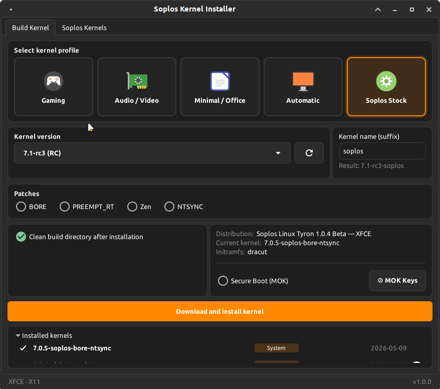
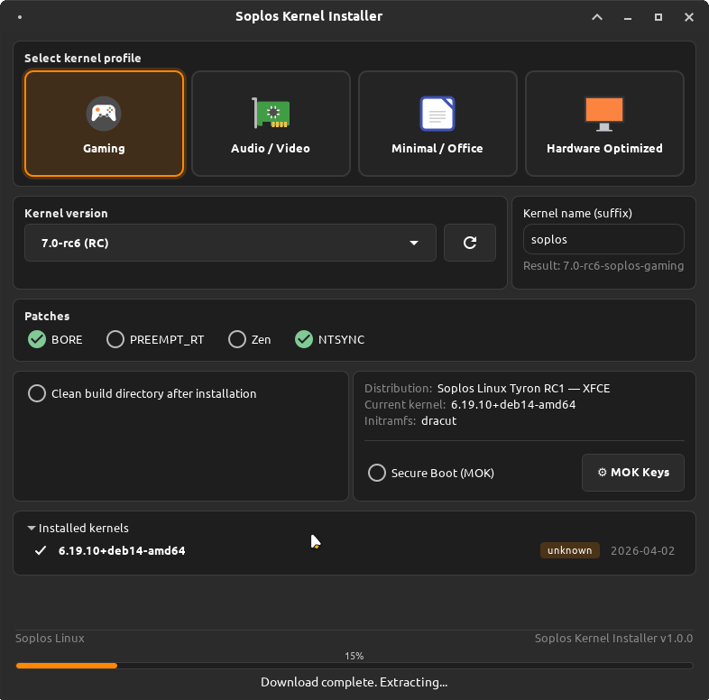
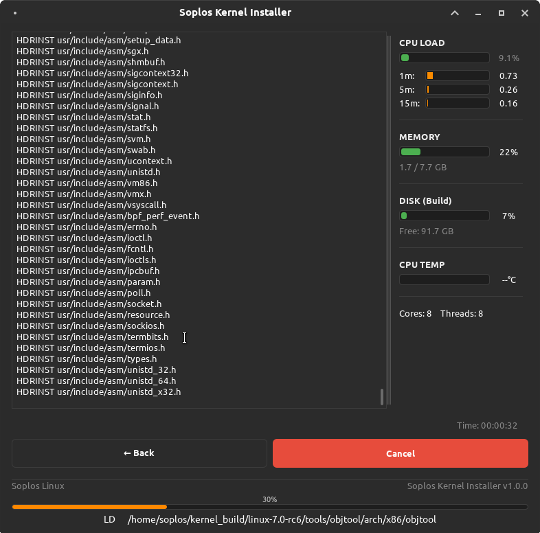
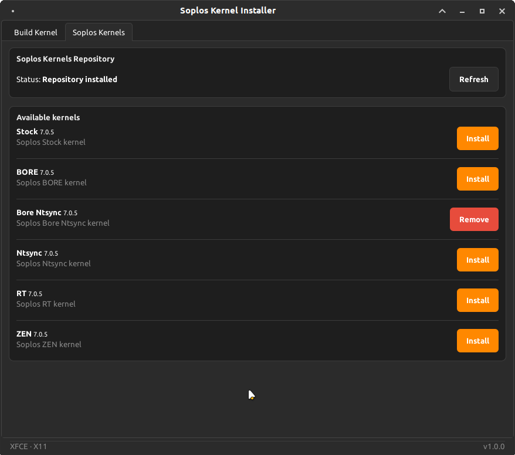
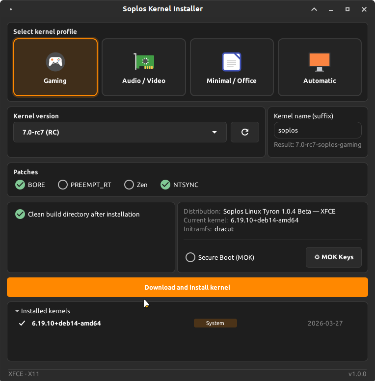

# Soplos Kernel Installer

[](https://www.gnu.org/licenses/gpl-3.0)
[]()

GTK3 graphical frontend for downloading, patching, compiling and installing the Linux kernel on Soplos Linux.

*Interfaz gráfica GTK3 para descargar, parchear, compilar e instalar el kernel Linux en Soplos Linux.*

## 📝 Description

Soplos Kernel Installer is a comprehensive graphical tool for downloading, patching, compiling and installing custom Linux kernels from kernel.org. It provides an intuitive interface for managing kernel versions, patches, and configurations with complete internationalization support.

## ✨ Features

- 📥 **Multiple channels**: Stable, LTS, RC, and Soplos Featured (curated versions)
- 🔧 **Patch support** from original upstream sources:
  - [BORE](https://github.com/firelzrd/bore-scheduler) — Burst-Oriented Response Enhancer
  - [PREEMPT_RT](https://cdn.kernel.org/pub/linux/kernel/projects/rt) — Full real-time preemption
  - [Zen](https://github.com/zen-kernel/zen-kernel) — Desktop/gaming optimizations
  - [NTSYNC](https://www.kernel.org) — NT synchronization primitives
- 🎯 **Kernel profiles**: Gaming · Audio/Video · Minimal/Office · Automatic
- 🔄 **Source reuse**: Recycle existing kernel sources for faster recompilation
- 🛡️ **Secure Boot** signing via MOK (generate keys, enroll in BIOS, sign kernel + EFI)
- 🎮 **NVIDIA DKMS** module signing for Secure Boot
- 📋 **Installation history** with automatic kernel tagging (XanMod, Liquorix, Zen, System...)
- 📦 **Soplos Kernels**: Install pre-built Stock, BORE, BORE+NTSYNC, Zen, NTSYNC and Real-Time (PREEMPT_RT) kernels from the official Soplos repository — no compilation required, list loaded dynamically from apt-cache
- 🌍 **8-language interface**: 🇩🇪 🇬🇧 🇪🇸 🇫🇷 🇮🇹 🇵🇹 🇷🇴 🇷🇺

### 🚀 Recent Updates (v1.0.0)
- **PREEMPT_RT Integration**: For kernels ≥6.12, PREEMPT_RT is integrated upstream — no external patch download, automatically enables `CONFIG_PREEMPT_RT=y`
- **Source Reuse**: Recycle existing kernel sources for faster subsequent compilations with patch conflict detection
- **Expandable History**: Installation history with automatic kernel tags and improved UI
- **Keyboard Shortcuts**: Ctrl+Q (quit), Ctrl+W (close), F5 (refresh), F1 (help/about), Ctrl+Tab / Ctrl+Shift+Tab (switch tabs)
- **NVIDIA Kernel 7.x Patch**: Automatically applies VMA locking API compatibility patch to NVIDIA DKMS sources before build — fixes compilation failure on kernel 7.0+
- **DKMS MOK Auto-Enroll**: After Secure Boot installation with NVIDIA GPU detected, automatically prompts to enroll the DKMS signing key — fixes NVENC and CUDA not working with Secure Boot
- **Save .deb Before Cleanup**: Offers to save compiled .deb packages to a chosen folder before deleting the build directory
- **MOK Key Path**: Key management dialog now shows where MOK keys are stored
- **Soplos Stock Profile** (hidden): Vanilla kernel profile for Soplos Linux distribution builds, accessible via Ctrl+Shift+D — no profile modifications, suffix `soplos`, compatible with all Soplos distributions
- **Fixed**: MOK password shell injection — password safely escaped before being passed to `mokutil`
- **Fixed**: Install button now disabled on first click to prevent duplicate builds
- **Fixed**: Custom kernel name validated against `[a-zA-Z0-9._-]` before proceeding
- **Fixed**: `remove_kernel()` validates release string before constructing shell commands
- **Fixed**: Interactive configuration prompts mid-build — second `make olddefconfig` pass resolves new Kconfig symbols introduced by profile options
- **Fixed**: All kernel profile compilation bugs (PREEMPT_DYNAMIC, THP, DEBUG_INFO Kconfig choice blocks)
- **Fixed**: GPU detection now checks only display/VGA/3D lines — AMD CPU no longer causes false positives
- **Fixed**: Cleanup checkbox now actually works
- **Fixed**: EOL kernels from kernel.org now shown as "(EOL)" with red warning — were previously hidden
- **Fixed**: Mainline kernels (e.g. 7.0) no longer incorrectly shown as "(latest)"
- **Improved**: MOK dialog now explains the DKMS automatic rebuild cycle on each new kernel install
- **Improved**: 9 missing i18n strings completed across all 8 languages
- **Dynamic Kernel List**: Soplos Kernels tab reads available packages from apt-cache at runtime — any package added to the repository appears automatically
- **Refresh Button**: Forces `apt-get update` and reloads the kernel list in the Soplos Kernels tab
- **Stock Profile Post-Build**: When building with the hidden Stock profile, automatically creates the corresponding metapackage .deb and prompts to save all packages (image + headers + metapackage) to a chosen folder — does not install the kernel
- **New kernel variants**: bore, bore-ntsync, zen, ntsync (renamed from gaming; linux-soplos-gaming → linux-soplos-bore)
- **Fixed**: Kernel release name now read from `include/config/kernel.release` in the source tree — correctly handles patch-injected version suffixes (e.g. `zen1` added by the Zen patch)
- **Kernel Version Display**: Available version shown next to each kernel name in the Soplos Kernels tab
- **Update Button**: When a newer version is available in the repository, an Update button appears — upgrades the metapackage and purges old kernel image and headers automatically
- **Fixed**: Stock post-build now correctly finds all .deb files when a patch injects a version suffix (e.g. `zen1`)
- **Fixed**: After updating a Soplos kernel, old image and headers packages are purged — no manual cleanup required
- 8-language interface: 🇩🇪 🇬🇧 🇪🇸 🇫🇷 🇮🇹 🇵🇹 🇷🇴 🇷🇺

## 📸 Screenshots

| Main window | Download progress | Build logs |
| :---: | :---: | :---: |
|  |  |  |

| Soplos Kernels tab | Soplos Stock profile |
| :---: | :---: |
|  |  |

## 🔧 Installation

```bash
# Installation instructions
sudo apt install soplos-kernel-installer
```

Or from source:

```bash
git clone https://github.com/SoplosLinux/soplos-kernel-installer
cd soplos-kernel-installer
sudo python3 setup.py install
```

## 🌐 Supported Languages

- 🇪🇸 Spanish (Español)
- 🇬🇧 English
- 🇫🇷 French (Français)
- 🇵🇹 Portuguese (Português)
- 🇩🇪 German (Deutsch)
- 🇮🇹 Italian (Italiano)
- 🇷🇺 Russian (Русский)
- 🇷🇴 Romanian (Română)

## 📄 License

This project is licensed under [GPL-3.0+](https://www.gnu.org/licenses/gpl-3.0.html) (GNU General Public License version 3 or later).

This license guarantees the following freedoms:
- The freedom to use the program for any purpose
- The freedom to study how the program works and modify it
- The freedom to distribute copies of the program
- The freedom to improve the program and publish those improvements

Any derivative work must be distributed under the same license (GPL-3.0+).

For more details, see the LICENSE file or visit [gnu.org/licenses/gpl-3.0](https://www.gnu.org/licenses/gpl-3.0.html).

## 👤 Developer

Developed by Sergi Perich  
Website: https://soplos.org  
Contact: info@soploslinux.com

## 🔗 Links

- [Website](https://soplos.org)
- [Report issues](https://github.com/SoplosLinux/soplos-kernel-installer/issues)
- [Help](https://soplos.org)

## 📦 Versions

### v1.0.0 (05/04/2026)
- **PREEMPT_RT Integration**: For kernels ≥6.12, PREEMPT_RT is integrated upstream — no external patch download, automatically enables `CONFIG_PREEMPT_RT=y`
- **Source Reuse**: Recycle existing kernel sources for faster subsequent compilations with automatic patch conflict detection
- **Expandable History**: Installation history with automatic kernel tags (XanMod, Liquorix, Zen, System...) and improved UI
- **Keyboard Shortcuts**: Ctrl+Q (quit), Ctrl+W (close), F5 (refresh), F1 (help/about), Ctrl+Tab / Ctrl+Shift+Tab (switch tabs)
- **About Dialog**: Application information with version, author, license and website
- **NTSYNC Patch**: Added NT synchronization primitives support for Wine/Proton gaming
- **NVIDIA Kernel 7.x Patch**: Automatically applies VMA locking API compatibility patch to NVIDIA DKMS sources before build (fixes DKMS failure on kernel 7.0+)
- **DKMS MOK Auto-Enroll**: Prompts to enroll DKMS signing key after Secure Boot install when NVIDIA GPU detected — fixes NVENC/CUDA with Secure Boot
- **Save .deb Before Cleanup**: Offers to save compiled packages before deleting the build directory
- **MOK Key Path**: Key management dialog shows the MOK key storage location
- **Fixed**: Incorrect generation of 1GB `-dbg` packages.
- **Fixed**: Kernel version naming discrepancies (e.g., 7.0-rc6 vs 7.0.0-rc6) for Secure Boot/NVIDIA signing.
- **Fixed**: Properly isolated kernel packages (`image` + `headers` + `libc-dev` only).
- **Fixed**: All kernel profile compilation bugs — PREEMPT_DYNAMIC, THP, DEBUG_INFO Kconfig choice blocks.
- **Fixed**: GPU detection checks only display/VGA/3D lines — AMD CPU no longer causes false positives.
- **Fixed**: Cleanup checkbox now actually triggers build directory removal.
- **Fixed**: Path quoting in `cp` and `make -C` commands.
- **Fixed**: MOK password shell injection — password safely escaped with `shlex.quote()`.
- **Fixed**: Install button disabled on first click to prevent duplicate builds.
- **Fixed**: Custom kernel name validated before install.
- **Fixed**: `remove_kernel()` validates release string before constructing shell commands.
- **Fixed**: Interactive config prompts mid-build — second `make olddefconfig` pass after profile options.
- **Added**: Soplos Stock hidden profile (Ctrl+Shift+D) for vanilla kernel distribution builds.
- **Improved**: MOK dialog explains DKMS automatic rebuild cycle on each new kernel install.
- **Improved**: Complete internationalization for 8 languages (9 additional strings).
- **Added**: Soplos Kernels tab — install pre-built Stock, Gaming and Real-Time kernels from the official Soplos repository with one click.
- **Added**: Tabbed interface (Build Kernel / Soplos Kernels) via `Gtk.Notebook`.
- **Added**: Persistent build history in `~/.local/share/soplos-kernel-installer/` — survives build directory cleanup, with automatic migration from previous locations.
- **Added**: `KDEB_PKGVERSION=1` — compiled packages no longer include the kernel version twice in the filename.
- **Fixed**: MOK signed kernel detection now also physically verifies vmlinuz files with `sbverify`.
- **Fixed**: STOCK profile package naming — trailing dash removed when suffix is empty.
- **Fixed**: Soplos Kernels detection based on `/boot/vmlinuz-*` — works regardless of how the kernel was removed.
- **Fixed**: Soplos Kernels Remove button always active for installed kernels even without repository configured.
- **Fixed**: Kernel history list refreshes after install/remove from the Soplos Kernels tab.
- **Fixed**: Kernel release now read from `include/config/kernel.release` in the source tree — correctly handles patch-injected version suffixes (e.g. `zen1` added by the Zen patch to the Makefile EXTRAVERSION).
- **Added**: Dynamic Kernel List — Soplos Kernels tab reads available packages from apt-cache at runtime; any new package in the repo appears automatically.
- **Added**: Refresh button in Soplos Kernels tab — forces `apt-get update` and reloads the list.
- **Added**: Stock profile post-build — creates metapackage .deb and prompts to save all packages (image + headers + metapackage) to a folder, without installing the kernel on the system.
- **Added**: New kernel variants: `linux-soplos-bore`, `linux-soplos-bore-ntsync`, `linux-soplos-zen`, `linux-soplos-ntsync` (linux-soplos-gaming renamed to linux-soplos-bore).
- **Added**: Ctrl+Tab / Ctrl+Shift+Tab keyboard shortcuts to switch between tabs.
- **Added**: Version number displayed next to each kernel name in the Soplos Kernels tab.
- **Added**: Update button in Soplos Kernels tab — appears when a newer version is available, upgrades the metapackage and purges old image and headers automatically.
- **Fixed**: Stock post-build package discovery now correctly handles patch-injected version suffixes (e.g. `zen1`) — old and new image/headers are found reliably.
- **Fixed**: After updating a Soplos kernel, old image and headers packages for the same variant are purged without requiring manual intervention.
