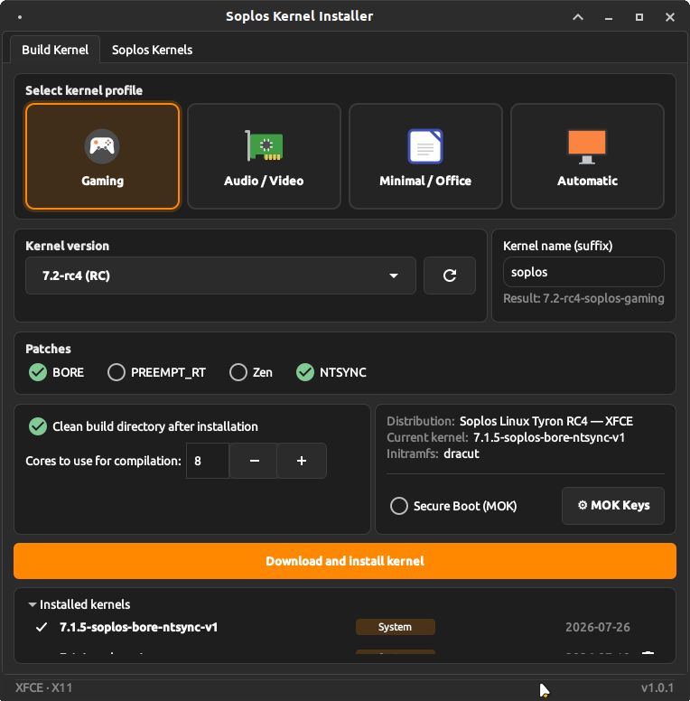
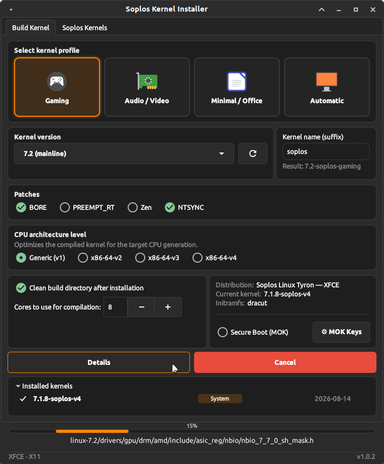
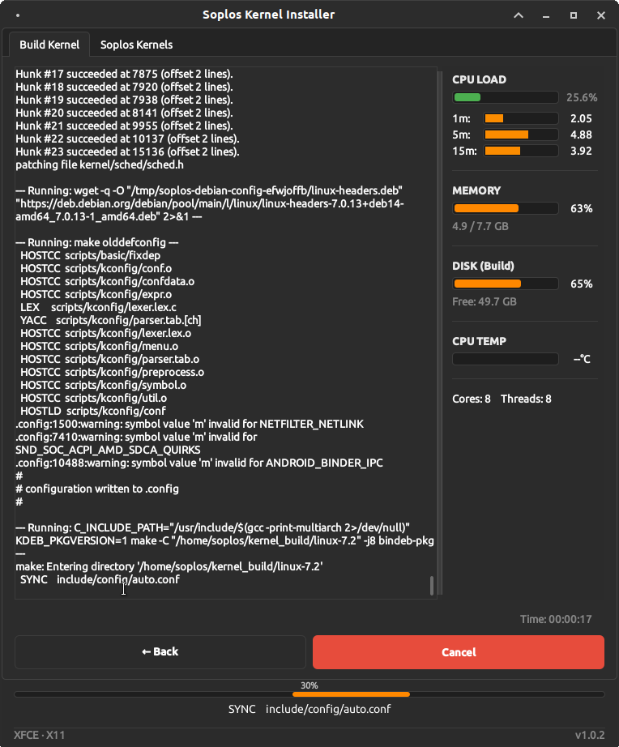
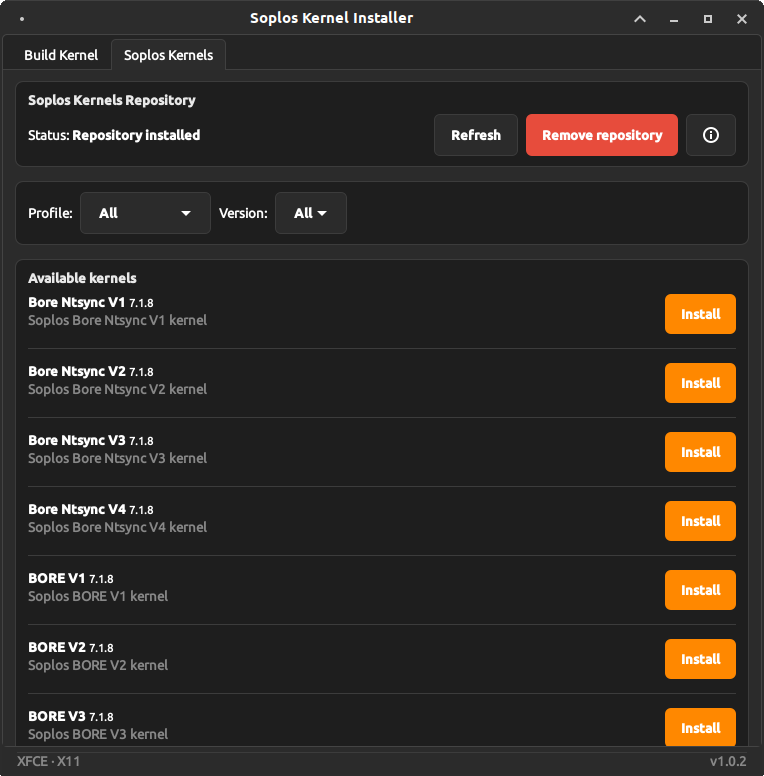
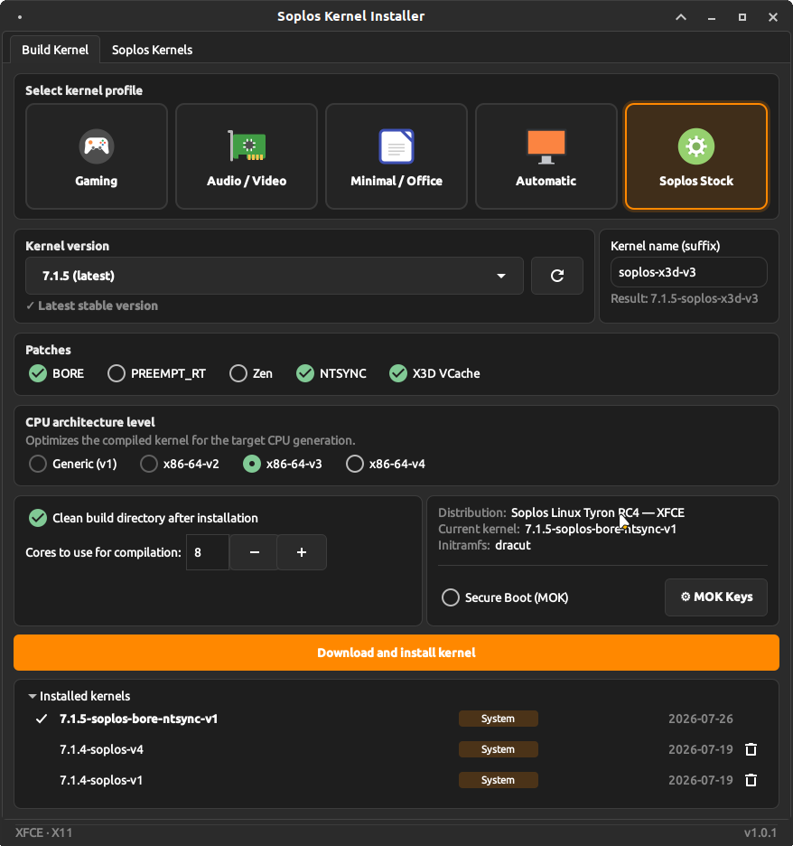

# Soplos Kernel Installer

[](https://www.gnu.org/licenses/gpl-3.0)
[]()

GTK3 graphical frontend for downloading, patching, compiling and installing the Linux kernel on Soplos Linux.

*Interfaz gráfica GTK3 para descargar, parchear, compilar e instalar el kernel Linux en Soplos Linux.*

## 📝 Description

Soplos Kernel Installer is a comprehensive graphical tool for downloading, patching, compiling and installing custom Linux kernels from kernel.org. It provides an intuitive interface for managing kernel versions, patches, and configurations with complete internationalization support.

## ✨ Features

- 📥 **Multiple channels**: Stable, LTS, RC, and Soplos Featured (curated versions)
- 🔧 **Patch support**, preferring original upstream sources, with a Soplos-maintained fallback for point releases upstream hasn't caught up with yet:
  - [BORE](https://github.com/firelzrd/bore-scheduler) — Burst-Oriented Response Enhancer (fallback: [bore-soplos](https://github.com/SoplosLinux/bore-soplos))
  - [PREEMPT_RT](https://cdn.kernel.org/pub/linux/kernel/projects/rt) — Full real-time preemption
  - [Zen](https://github.com/zen-kernel/zen-kernel) — Desktop/gaming optimizations (fallback: [zen-soplos](https://github.com/SoplosLinux/zen-soplos))
  - [NTSYNC](https://www.kernel.org) — NT synchronization primitives
  - [X3D VCache](https://github.com/SoplosLinux/x3d-soplos) — AMD Ryzen X3D dual-CCD scheduler preference (Stock mode)
- 🎯 **Kernel profiles**: Gaming · Audio/Video · Minimal/Office · Automatic
- 🔄 **Source reuse**: Recycle existing kernel sources for faster recompilation
- 🛡️ **Secure Boot** signing via MOK (generate keys, enroll in BIOS, sign kernel + EFI)
- 🎮 **NVIDIA DKMS** module signing for Secure Boot
- 📋 **Installation history** with automatic kernel tagging (XanMod, Liquorix, Zen, System...)
- 📦 **Soplos Kernels**: Install pre-built Stock, BORE, BORE+NTSYNC, Zen, NTSYNC and Real-Time (PREEMPT_RT) kernels from the official Soplos repository — no compilation required, list loaded dynamically from apt-cache
- 🌍 **8-language interface**: 🇩🇪 🇬🇧 🇪🇸 🇫🇷 🇮🇹 🇵🇹 🇷🇴 🇷🇺

### 🚀 Recent Updates (v1.0.2-2)
- **Added**: March selector (V1-V4) now available for every profile, not just Stock. Also added kernel selection (checkboxes) and resume (skip already-built) for the Stock batch build, instead of always building all 26 or none.
- **Fixed**: The march selector and other profile-dependent UI never initialized for the default profile shown at launch — `ProfileSelector`'s first radio button starts pre-active, so its own `set_active(True)` never fired `toggled`/`profile-changed`.
- **Fixed**: A V3/V4 build outside Stock mode was never reflected in the kernel's name — now appended whenever it isn't the default v1.
- **Fixed**: The batch "Build all 26 kernels" button kept saying 26 after narrowing the selection in the dialog.

### Previous Updates (v1.0.2-1)
- **Fixed**: NVIDIA DKMS builds failed on kernel 7.2+ with `implicit declaration of function 'strncpy'` in `nvidia/os-interface.c` — some kernel header that used to transitively pull in `<linux/string.h>` stopped doing so, and GCC now treats that as a hard error. Added a new embedded compatibility patch (`NV_STRING_H_PATCH`) applied automatically alongside the existing VMA-locking fix, mirrored in `nvidia-patches` as Fix 4.

### Previous Updates (v1.0.2)
- **Fixed**: The x86-64 ISA level (march) patch silently never applied on any kernel other than exactly 7.1.x — `_download_march()` requested a `7.x`-tagged fallback file that never existed in `soplos-cpu-kernel-patch`, 404'd, and the build proceeded without the patch (v2/v3/v4 silently fell back to v1). First surfaced on kernel 7.2. Simplified the tag logic to always request the `7.x` file, which now exists and is verified across 7.1.x and 7.2.
- **Note**: BORE, X3D and Zen also needed their own rebases to build again on kernel 7.2 — see `bore-soplos`, `x3d-soplos` and `zen-soplos`. No further code changes were needed here; the existing fallback chains already routed correctly once those repos had the right files.

### Previous Updates (v1.0.1-9)
- **Added**: Unattended release build in Stock mode — compiles every kernel of a release one after another, each from a clean build directory, saving the packages into `<destination>/<version>/V1`–`V4`. The queue stops at the first failure and keeps that build directory so the log survives.
- **Fixed**: The x86-64 architecture level was never applied. The build set `CONFIG_GENERIC_CPU{2,3,4}`, symbols that do not exist in mainline, so `olddefconfig` dropped them and every kernel was compiled at the v1 baseline — `-v2`, `-v3` and `-v4` were identical to `-v1`. The level now comes from [soplos-cpu-kernel-patch](https://github.com/SoplosLinux/soplos-cpu-kernel-patch), and the build aborts if the symbol does not survive configuration instead of shipping a mislabelled kernel.
- **Translations**: batch interface translated into all eight languages, plus six older strings left untranslated since v1.0.1-7.
- **Note**: v4 produces the same binary as v3 — their only difference is AVX-512 and the kernel disables vector code generation.

### v1.0.1-8
- **Fixed**: the NVIDIA DKMS patch was silently skipped on the open kernel modules (`nvidia-open-590`/`610`), which keep their sources under `kernel-open/nvidia/`. Both source layouts are handled now, so installing a kernel patches the driver on Turing and newer as well.
- **Fixed**: the patch is only applied when the source actually uses `VMA_LOCK_OFFSET`, instead of always trying and printing a failed-patch warning on newer drivers.
- **Removed**: dead constants `DRACUT_CONF_DIR` and `DRACUT_SOPLOS_CONF`.

### v1.0.1-7
- **Added**: Core count selector for compilation — spin button next to the cleanup option, defaults to all logical cores, available in both regular and Stock modes.
- **Added**: Profile and Version (V1–V4) filters in the Soplos Kernels tab, populated from whatever's actually in the repo.
- **Fixed**: Kernel list filters no longer leave "Install"/"Remove" buttons blank until a manual refresh.
- **Fixed**: The filters row now sits in its own card instead of a barely-visible separator line.

### Previous Updates (v1.0.1-6)
- **Fixed**: BORE/Zen patch sources that downloaded successfully but failed to apply against the current kernel point release no longer abort the build — they're now verified with a dry-run apply and the next source in the fallback chain is tried automatically.
- **Fixed**: Selecting Zen no longer silently builds a kernel that still runs mainline CFS/EEVDF — `CONFIG_SCHED_ALT`/`CONFIG_SCHED_PDS` are now forced on (Zen's own Kconfig default for `SCHED_ALT` is "n", unlike BORE's "y"). Confirmed on real hardware: the alternate scheduler is genuinely active at boot, not just compiled in.
- **Added**: [SoplosLinux/bore-soplos](https://github.com/SoplosLinux/bore-soplos) and [SoplosLinux/zen-soplos](https://github.com/SoplosLinux/zen-soplos) as fallback patch sources for BORE and Zen, used only when upstream hasn't published a working patch for the requested kernel version yet.

### Previous Updates (v1.0.1-5)
- **Changed**: The "Which kernel is right for my hardware?" popup now also shows the detected CPU model, GPU, and total RAM alongside the supported x86-64 architecture level.

### Previous Updates (v1.0.1-4)
- **Changed**: The "Which kernel is right for my hardware?" button no longer opens the wiki — it now detects the highest x86-64 architecture level (v1–v4) the CPU actually supports and shows it directly in the app.

### Previous Updates (v1.0.1-3)
- **Fixed**: Selecting X3D could leave Zen checked alongside the auto-selected BORE (if Zen was already active), sending an incompatible patch combination to the build and breaking it.

### Previous Updates (v1.0.1-2)
- **Fixed**: X3D VCache patch download now uses a per-kernel-version URL (6.x/7.0/7.1) instead of a single stale link.
- **Fixed**: Base kernel configuration is now fetched fresh from Debian sid on every build instead of copying a previously installed kernel's config — avoids configuration drift and missing support for recent hardware.
- **Fixed**: Build failure caused by an inherited module signing key path only valid inside Debian's own build system.
- **Fixed**: Patch tooltips (BORE, PREEMPT_RT, Zen, NTSYNC, X3D VCache) were never translated — now properly localized in all 8 languages.
- **Added**: `ASUS_ARMOURY` and `OXP_EC` handheld gaming EC drivers forced as modules in every build (ROG Ally, OneXPlayer/AYANEO).
- **Added**: v1/v2 CPU architecture levels now disabled automatically when the X3D patch is selected.

### Previous Updates (v1.0.1-1)
- **Fixed**: Soplos Kernels tab now detects march-level package variants (`linux-soplos-bore-v3`, etc.).
- **Fixed**: Display names for march-level packages: `linux-soplos-v3` → "Stock V3", `linux-soplos-bore-v3` → "BORE V3".

### Previous Updates (v1.0.1)
- **Added**: x86-64 microarchitecture level selector in Stock mode (v1 Generic / v2 SSE4.2+ / v3 AVX2+ / v4 AVX-512) for building march-optimized kernels.
- **Added**: X3D VCache scheduler patch (Stock mode only) — original Soplos patch that steers tasks to the VCache CCD on AMD Ryzen X3D dual-CCD processors. Auto-selects BORE + NTSYNC. Named `soplos-x3d-vN`.
- **Added**: Wiki info button in Soplos Kernels tab linking to the CPU Compatibility guide.
- **Added**: Auto-generated kernel name in Stock mode based on selected patches and march level.

### Previous Updates (v1.0.0-4)
- **Fixed**: NVIDIA DKMS patch now also applied when installing or updating kernels from the Soplos Kernels repository tab — previously only ran when compiling from source.
- **Fixed**: NVIDIA VMA patch now uses `--fuzz=5` to cover driver versions with minor line offset differences (e.g. 590.x).

### Previous Updates (v1.0.0-3)
- **Fixed**: Update button appearing incorrectly after updating a kernel — the old vmlinuz still present in `/boot` before reboot was being detected as an outdated version. The vmlinuz fallback now only activates when the metapackage is not registered in apt at all.

### Previous Updates (v1.0.0-2)
- **Fixed**: Update button in Soplos Kernels tab not appearing when a newer kernel version was available — `apt-cache show` returns multiple stanzas when versions differ; the code was reading the last stanza (old version) instead of the first (candidate). Now stops at the first stanza.
- **Fixed**: After installing, updating or removing a Soplos kernel, the package list was refreshed with stale data. Now fully re-fetches from apt so the Update button reflects the real state.
- **Fixed**: `apt-cache policy` and `apt-cache show` output field names in the system language on non-English systems (`Instalados:` / `Candidato:` in Spanish). The code was parsing English-only strings, so `installed_ver` was always empty and the Update button never appeared. Fixed by forcing `LC_ALL=C` on all apt-cache calls.
- **Added**: Remove repository button in Soplos Kernels tab — removes the repository source and GPG key without affecting installed kernels.

### Previous Updates (v1.0.0-1)
- **PREEMPT_RT Integration**: For kernels ≥6.12, PREEMPT_RT is integrated upstream — no external patch download, automatically enables `CONFIG_PREEMPT_RT=y`
- **Source Reuse**: Recycle existing kernel sources for faster subsequent compilations with patch conflict detection
- **Expandable History**: Installation history with automatic kernel tags and improved UI
- **Keyboard Shortcuts**: Ctrl+Q (quit), Ctrl+W (close), F5 (refresh), F1 (help/about), Ctrl+Tab / Ctrl+Shift+Tab (switch tabs)
- **NVIDIA Kernel 7.x Patch**: Automatically applies VMA locking API compatibility patch to NVIDIA DKMS sources before build — fixes compilation failure on kernel 7.0+
- **DKMS MOK Auto-Enroll**: After Secure Boot installation with NVIDIA GPU detected, automatically prompts to enroll the DKMS signing key — fixes NVENC and CUDA not working with Secure Boot
- **Save .deb Before Cleanup**: Offers to save compiled .deb packages to a chosen folder before deleting the build directory
- **MOK Key Path**: Key management dialog now shows where MOK keys are stored
- **Soplos Stock Profile** (hidden): Vanilla kernel profile for Soplos Linux distribution builds, accessible via Ctrl+Shift+D — no profile modifications, suffix `soplos`, compatible with all Soplos distributions
- **Fixed**: MOK password shell injection — password safely escaped before being passed to `mokutil`
- **Fixed**: Install button now disabled on first click to prevent duplicate builds
- **Fixed**: Custom kernel name validated against `[a-zA-Z0-9._-]` before proceeding
- **Fixed**: `remove_kernel()` validates release string before constructing shell commands
- **Fixed**: Interactive configuration prompts mid-build — second `make olddefconfig` pass resolves new Kconfig symbols introduced by profile options
- **Fixed**: All kernel profile compilation bugs (PREEMPT_DYNAMIC, THP, DEBUG_INFO Kconfig choice blocks)
- **Fixed**: GPU detection now checks only display/VGA/3D lines — AMD CPU no longer causes false positives
- **Fixed**: Cleanup checkbox now actually works
- **Fixed**: EOL kernels from kernel.org now shown as "(EOL)" with red warning — were previously hidden
- **Fixed**: Mainline kernels (e.g. 7.0) no longer incorrectly shown as "(latest)"
- **Improved**: MOK dialog now explains the DKMS automatic rebuild cycle on each new kernel install
- **Improved**: 9 missing i18n strings completed across all 8 languages
- **Dynamic Kernel List**: Soplos Kernels tab reads available packages from apt-cache at runtime — any package added to the repository appears automatically
- **Refresh Button**: Forces `apt-get update` and reloads the kernel list in the Soplos Kernels tab
- **Stock Profile Post-Build**: When building with the hidden Stock profile, automatically creates the corresponding metapackage .deb and prompts to save all packages (image + headers + metapackage) to a chosen folder — does not install the kernel
- **New kernel variants**: bore, bore-ntsync, zen, ntsync (renamed from gaming; linux-soplos-gaming → linux-soplos-bore)
- **Fixed**: Kernel release name now read from `include/config/kernel.release` in the source tree — correctly handles patch-injected version suffixes (e.g. `zen1` added by the Zen patch)
- **Kernel Version Display**: Available version shown next to each kernel name in the Soplos Kernels tab
- **Update Button**: When a newer version is available in the repository, an Update button appears — upgrades the metapackage and purges old kernel image and headers automatically
- **Fixed**: Stock post-build now correctly finds all .deb files when a patch injects a version suffix (e.g. `zen1`)
- **Fixed**: After updating a Soplos kernel, old image and headers packages are purged — no manual cleanup required
- 8-language interface: 🇩🇪 🇬🇧 🇪🇸 🇫🇷 🇮🇹 🇵🇹 🇷🇴 🇷🇺

## 📸 Screenshots

| Main window | Download progress | Build logs |
| :---: | :---: | :---: |
|  |  |  |

| Soplos Kernels tab | Soplos Stock profile |
| :---: | :---: |
|  |  |

## 🔧 Installation

```bash
# Installation instructions
sudo apt install soplos-kernel-installer
```

Or from source:

```bash
git clone https://github.com/SoplosLinux/soplos-kernel-installer
cd soplos-kernel-installer
sudo python3 setup.py install
```

## 🌐 Supported Languages

- 🇪🇸 Spanish (Español)
- 🇬🇧 English
- 🇫🇷 French (Français)
- 🇵🇹 Portuguese (Português)
- 🇩🇪 German (Deutsch)
- 🇮🇹 Italian (Italiano)
- 🇷🇺 Russian (Русский)
- 🇷🇴 Romanian (Română)

## 📄 License

This project is licensed under [GPL-3.0+](https://www.gnu.org/licenses/gpl-3.0.html) (GNU General Public License version 3 or later).

This license guarantees the following freedoms:
- The freedom to use the program for any purpose
- The freedom to study how the program works and modify it
- The freedom to distribute copies of the program
- The freedom to improve the program and publish those improvements

Any derivative work must be distributed under the same license (GPL-3.0+).

For more details, see the LICENSE file or visit [gnu.org/licenses/gpl-3.0](https://www.gnu.org/licenses/gpl-3.0.html).

## 👤 Developer

Developed by Sergi Perich  
Website: https://soplos.org  
Contact: info@soploslinux.com

## 🔗 Links

- [Website](https://soplos.org)
- [Report issues](https://github.com/SoplosLinux/soplos-kernel-installer/issues)
- [Help](https://soplos.org)

